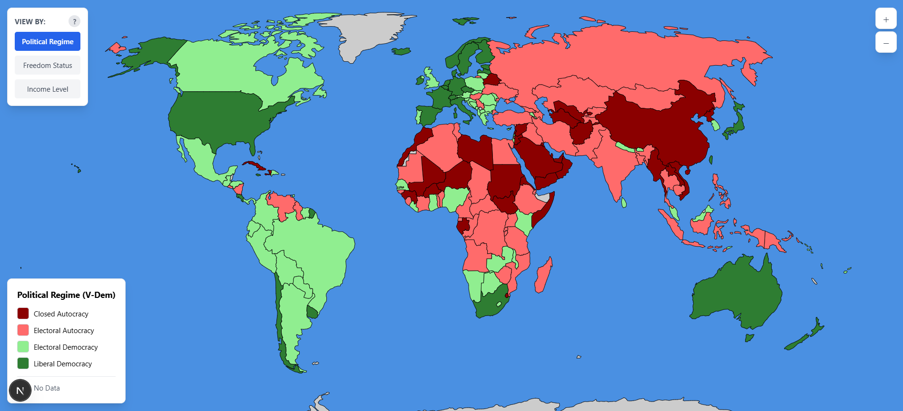

# PoliticalMap

**Explore political regimes, civil freedoms, and income levels across 179 countries — powered by V-Dem, Freedom House, and World Bank data.**



An interactive world map that makes global political and economic data approachable. Click any country for a Wikipedia summary, a 10-year regime history chart, and classifications across all three datasets at once.

---

## What it shows

| Dataset | Source | Coverage | Categories |
|---|---|---|---|
| **Political Regime** | [V-Dem Institute](https://www.v-dem.net/) | 179 countries | Closed Autocracy · Electoral Autocracy · Electoral Democracy · Liberal Democracy |
| **Freedom Status** | [Freedom House](https://freedomhouse.org/) | 190 countries | Not Free · Partly Free · Free |
| **Income Level** | [World Bank](https://datahelpdesk.worldbank.org/knowledgebase/articles/906519) | 217 economies | Low · Lower Middle · Upper Middle · High |

All datasets reflect the most recent available year (primarily 2024). Click the **?** button on the map to read exactly how each source collects its data and what each category means.

---

## Features

- **Three dataset views** — toggle between regime, freedom, and income; the map recolors instantly
- **Country info popup** — click any country to see a Wikipedia summary, thumbnail, all three classifications, and a 10-year political regime history chart
- **Hover tooltips** — country name and current classification on hover
- **Smooth zoom & pan** — scroll to zoom (up to 12×), drag to pan with smart boundary constraints
- **Data explainer** — built-in methodology notes for every source, accessible via the **?** button
- **Error states** — clear feedback if any dataset fails to load; never a silent gray map

---

## Data methodology (brief)

**V-Dem** employs over 3,500 country experts who score political conditions via standardized surveys. The "Regimes of the World" typology (Lührmann et al., 2018) classifies countries by combining an Electoral Democracy Index with a Liberal Component Index. Where the primary indicator is missing, the Boix-Miller-Rosato binary democracy measure from the same dataset is used as a fallback. Countries where current-year data is unavailable show their most recent recorded classification.

**Freedom House** rates political rights and civil liberties across 25 indicators (0–100 score). Free = 70–100, Partly Free = 40–69, Not Free = 0–39.

**World Bank** classifies economies by GNI per capita using the Atlas method (3-year smoothed exchange rate). Thresholds are updated every July 1.

---

## Getting started

**Prerequisites:** Node.js 18+

```bash
git clone https://github.com/sirindudler/PoliticalMap.git
cd PoliticalMap
npm install
npm run dev
```

Open [http://localhost:3000](http://localhost:3000).

```bash
npm run build   # production build
npm start       # serve production build
```

---

## Updating data

All processed JSON files are committed to the repo. To refresh from upstream sources:

```bash
# Download latest V-Dem dataset and regenerate regime + timeseries JSON
npm run update:vdem

# Download latest World Bank income classifications
npm run update:worldbank

# Or update everything at once
npm run update:all
```

V-Dem publishes new data annually (usually February–March). World Bank classifications update every July 1. Freedom House publishes annually in January.

---

## Project structure

```
app/
  page.js                      # Home page — full-screen map
  layout.js                    # Root layout & metadata
components/
  WorldMap.jsx                 # Map, zoom/pan, tooltips, popup, dataset toggle
  DataSourcesModal.jsx         # "?" explainer — methodology and category definitions
public/
  world-countries.json         # Country geometries (Natural Earth 110m GeoJSON)
  regime-data.json             # V-Dem regime classifications (2024)
  regime-timeseries.json       # V-Dem 10-year history per country (2015–2024)
  freedom-house-data.json      # Freedom House freedom status
  world-bank-income-data.json  # World Bank income classifications
scripts/
  fetch-vdem.js                # Downloads V-Dem CSV → regime-data.json + regime-timeseries.json
  fetch-worldbank.js           # Downloads World Bank API → world-bank-income-data.json
  process-freedom-house.js     # Converts Freedom House Excel → freedom-house-data.json
  process-worldbank-income.js  # Converts World Bank Excel → world-bank-income-data.json
  process-vdem-timeseries.js   # Standalone: converts V-Dem CSV → regime-timeseries.json
.github/workflows/
  deploy.yml                   # GitHub Pages deploy on push to main
  update-data.yml              # Daily data refresh via GitHub Actions
```

---

## Tech stack

- [Next.js 15](https://nextjs.org/) + React 18 — static export, no server required
- [react-simple-maps](https://www.react-simple-maps.io/) — D3-backed map rendering (geoNaturalEarth1 projection)
- [Tailwind CSS](https://tailwindcss.com/)
- GeoJSON from [Natural Earth](https://www.naturalearthdata.com/) (110m resolution)

---

## License

MIT
